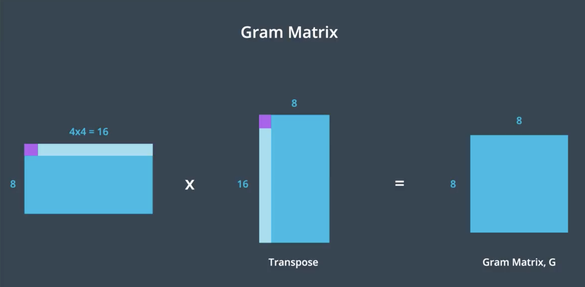

# Style-Transfer

## Project Overview

Implemented [Image Style Transfer Using Convolutional Neural Networks by Gatys](https://www.cv-foundation.org/openaccess/content_cvpr_2016/papers/Gatys_Image_Style_Transfer_CVPR_2016_paper.pdf). 

Rendering the semantic content of an image in different
styles is a difficult image processing task widely known as **Image Style Transfer**. In this project, I implemented Image Style Transfer using features extracted from pre-trained **VGG-19**. 
Image Style Transfer requires two images **Content Image** from which objects and arrangements are extracted and **Style Image** from which style, colors and textures are extracted. Using objects from Content Image and colors and textures from Style Image a new **Target Image** is generated.   

## Detailed Steps and Explanation

Style transfer relies on separating the content and style of an image. Given one content image and one style image, we aim to create a new, target image which should contain our desired content and style components:
- objects and their arrangement are similar to that of the content image
- style, colors, and textures are similar to that of the style image
- Used pre-trained VGG19 Net to extract content or style features from a passed in image 

                                   Fig 1. Image Style Transfer Process

 <table>
  <tr>
    <td>Content Extraction from Content Image</td>
     <td>Style Extraction from Style Image</td>
     <td>Generating Target Image</td>
  </tr>
  <tr>
    <td></td>
    <td></td>
    <td></td>
  </tr>
 </table>                                     

### Steps 
- Content and Style features are extracted using **Vgg-19** convolutional and pooling layers so vgg19.classifier layers are discarded.  
- According to [Gayts](https://www.cv-foundation.org/openaccess/content_cvpr_2016/papers/Gatys_Image_Style_Transfer_CVPR_2016_paper.pdf) the deeper layers of Convolutional Neural Network capture the high-level content in terms of objects and their arrangement in the input image but do not constrain the exact pixel values of the reconstruction (per pixel colors, textures). In contrast, lower layers simply reproduce the exact pixel values of
the original image. 
Following above, **content features are extracted using conv4_2 layer of Vgg-19**.  
- The style representation are computed using correlations between the different features in different layers of the CNN using Gram Matrix(It detects how strongly features in one feature map relate to other feature map from same CNN layer eg. common color). 
With co-relations from multiple CNN layers a multi-scale style representation of input image is obtained.  
Following above, **Style features are extracted using different Gram Matrix corresponding to each convolutional layer of Vgg-19**. 

- The style representations are calculated as style image passes through the network at first convolutional layer in all 5 convolutional stacks i.e convx_1, where correlations at each layer are given using a gram matrix. 
Steps to generate Gram Matrix at each convolutional layer stack are:  
    - x,y  dimensions of feature maps are flattened thus (no_of_feature_maps,x,y) becomes (no_of_feature_maps,x*y).
    - The above matrix is multiplied by its transpose to obtain Gram Matrix of dimension (no_of_feature_maps,no_of_feature_maps) for current convolutional layer stack. (this step keeps non localized information) 
                                   Fig 2. Gram Matrix Generation 

 <table>
  <tr>
    <td>5 Gram Matrices for Vgg-19</td>
     <td>Flattening feature maps</td>
     <td>Constructing Gram Matrix</td>
  </tr>
  <tr>
    <td></td>
    <td></td>
    <td></td>
  </tr>
 </table> 

- For generating the target image using content and style features, we change the target image until its content matches to content image and style matches to style image. Original target image is taken as the content image clone and trained until the loss is minimized. 

- Content and Style Loss: 
    - **Content Loss** :- Compares the content representation of content and target image using mean squared error. **Content representation is taken from conv4_2 layer of Vgg-19 for both images**
    
    - **Style Loss** :- Computed using **mean squared distance between gram matrices of style and target image at each layer (conv1_1,conv2_1,conv3_1,conv4_1,conv5_1)** 
    Separate weights for each layers used, a is a constant for number of values in each layer.

    - **Total Loss** : **Content Loss + Style Loss** , It is used along with back propagation to iteratively change the target image to minimize the loss. 
                                   Fig 3. Content and Style Loss

 <table>
  <tr>
    <td>Content Loss</td>
     <td>Style Loss</td>
     <td>Total Loss</td>
  </tr>
  <tr>
    <td></td>
    <td></td>
    <td></td>
  </tr>
 </table>                                     

- Constant weights &alpha; and &beta; are used to balance out total loss over both losses. **Often the style weights are kept much larger** and weights are expressed as a **ratio &alpha;/&beta; which implies the smaller the ratio the more stylistic effect visible**.   

                                   Fig 4. Content-style ratio

## Hyper Parameters 

- Style weights corresponding to each layer  

                                   Fig 5. Layer wise style weights

- Content weight, Style weight and Number of epochs

                                   Fig 6. Other Hyper Parameters

## Results

Following are the results of the project:

                                        Fig 7. Image Style Transfer  
   

                                         

                                

## References

1. [Image Style Transfer Using Convolutional Neural Networks by Gatys](https://www.cv-foundation.org/openaccess/content_cvpr_2016/papers/Gatys_Image_Style_Transfer_CVPR_2016_paper.pdf). 
2. [Udacity - Pytorch Nanodegree](https://www.udacity.com/course/deep-learning-pytorch--ud188)

## Project Team Members

1. Akanksha Shrimal
